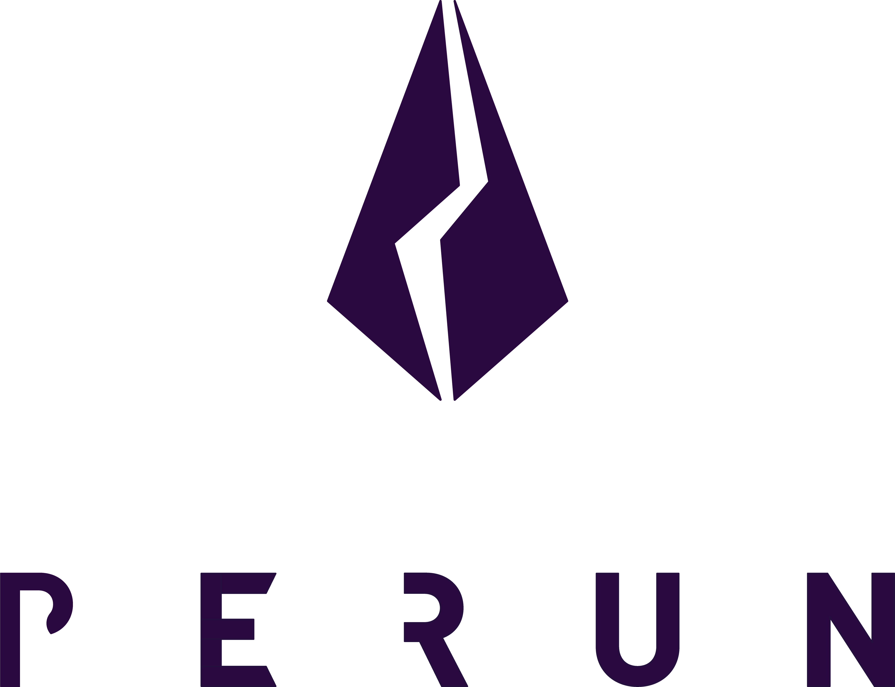

<h1 align="center"><br>
    <a href="https://perun.network/"></a>
<br></h1>

<h4 align="center">Perun Blockchain-Agnostic State Channels Framework</h4>

<p align="center">
  <a href="https://goreportcard.com/report/github.com/perun-network/go-perun"></a>
  <a href="https://perun.mit-license.org/"></a>
</p>

_go-perun_ is a Go implementation of the [Perun state channel protocols](https://perun.network/) ([introduction paper](https://drive.google.com/file/d/1phBzFXt2QDEemh0JIOAI80nibe3JTRu5/view)).
The perun protocols provide payment and general state channel functionality to all existing blockchains that feature smart contracts.
As a blockchain scalability solution, payment and state channels reduce transaction costs and increase the system throughput by executing incremental transactions off-chain.
The Perun protocols have been proven cryptographically secure in the UC-framework.
They are blockchain-agnostic and only rely on a blockchain's capability to execute smart contracts.

## Security Disclaimer

_go-perun_ is still alpha software.
It should not be used in production.
The Ariel release is not intended to have any practical use, and should only give potential users a general impression and invite feedback.
Some essential features, such as dispute resolution, are not yet implemented.
The authors take no responsibility for any loss of digital assets or other damage caused by the use of this software.
**Do not use this software with real funds**.

## Getting Started

Running _go-perun_ requires a working Go distribution (version 1.13 or higher).
```sh
# Clone the repository into a directory of your choice
git clone https://github.com/perun-network/go-perun.git
# Or directly download it with go
# go get -d perun.network/go-perun
cd go-perun
# Run the unit tests
go test ./...
```

You can import _go-perun_ in your project like this:
```go
import "perun.network/go-perun/client"
```

_go-perun_ implements the core state channel protocol in a blockchain-agnostic fashion by following the dependency inversion principle.
For this reason, a blockchain backend has to be chosen and blockchain-specific initializations need to be executed at program startup.

### Backends

There are multiple backends available as part of the Ariel release: Ethereum (`backend/ethereum`), and a simulated, ideal blockchain backend (`backend/sim`).
A backend is automatically initialized when its `wallet` and `channel` packages are imported.
The Ethereum smart contracts can be found in our [contracts-eth](https://github.com/perun-network/contracts-eth) repository.

Logging and networking capabilities can also be injected by the user.
A default [logrus](https://github.com/sirupsen/logrus) implementation of the `log.Logger` interface can be set using [`log/logrus.Set`](log/logrus/logrus.go#L40).
The Perun framework relies on `peer.Dialer` and `peer.Listener` implementations for networking.

## Features

_go-perun_ currently only supports a reduced set of features compared to the full protocols.
The following table shows the list of features needed for the minimal, secure, production-ready software.

| Feature                                          | Ariel release      |
| ------------------------------------------------ | ------------------ |
| Two-party ledger state channels                  | :heavy_check_mark: |
| Cooperatively settling two-party ledger channels | :heavy_check_mark: |
| Ledger channel dispute                           | :x:                |
| Dispute watchtower                               | :x:                |
| Data persistence                                 | :x:                |

The following features are planned after the above features have been implemented:
* Generalized two-party ledger channels
* Virtual channels (direct dispute)
* Multi-party ledger channels
* Virtual two-party channels (indirect dispute)
* Virtual multi-party channels (direct dispute)
* Cross-blockchain virtual channels (indirect dispute)

## API Primer

In essence, _go-perun_ provides a state channel network client, akin to ethereum's `ethclient` package, to interact with a state channels network.
Once the client has been set up, it can be used to propose channels to other network peers, send updates on those channels and eventually settle them.
A minimal, illustrative usage is as follows
```go
import (
	// other imports
	"perun.network/go-perun/client"
	"perun.network/go-perun/channel"
	"perun.network/go-perun/peer"
)

func main() {
	// 1. setup networking:
	var dialer peer.Dialer
	var listener peer.Listener
	// 2. setup blockchain interaction:
	var funder channel.Funder
	var settler channel.Settler
	// 3. setup off-chain identity:
	var identity peer.Identity
	// 4. choose how to react to incoming channel proposals:
	var proposalHandler client.ProposalHandler

	// 5. create state channel network client
	c := client.New(identity, dialer, proposalHandler, funder, settler)
	// 6. optionally start listening for incoming connections
	go c.Listen(listener)

	// 7. propose a new channel
	ctx, cancel := context.WithTimeout(context.Background(), 10*time.Minute)
	defer cancel()
	ch, err := c.ProposeChannel(ctx, &client.ChannelProposal{
		// details of channel proposal, like peers, app, initial balances, ...
	})
	if err != nil { /* handle error */ }

	// 8. choose how to react to incoming channel update requests
	var updateHandler client.UpdateHandler
	go ch.ListenUpdates(updateHandler)

	// 9. send a channel update request to the other channel peer(s)
	err = ch.Update(ctx, client.ChannelUpdate{
		// details of channel update
	})
	if err != nil { /* handle error */ }

	// 10. send further updates and finally, settle/close the channel:
	err = ch.Settle(ctx)
	if err != nil { /* handle error */ }
}
```

## Acknowledgements

This project is currently being developed by a group of dedicated hackers at the Applied Cryptography research group at Technische Universität Darmstadt, Germany.
We thank the German Federal Ministry of Education and Research (BMBF) for their funding through the StartUpSecure grants program as well as the German Science Foundation (DFG), the Foundation for Polish Science (FNP) and the Ethereum Foundation for their support in the research that preceded this implementation.

## Copyright

Copyright &copy; 2020 Chair of Applied Cryptography, Technische Universität Darmstadt, Germany.
All rights reserved.
Use of the source code is governed by a MIT-style license that can be found in the [LICENSE file](LICENSE).

Contact us at [info@perun.network](mailto:info@perun.network).
